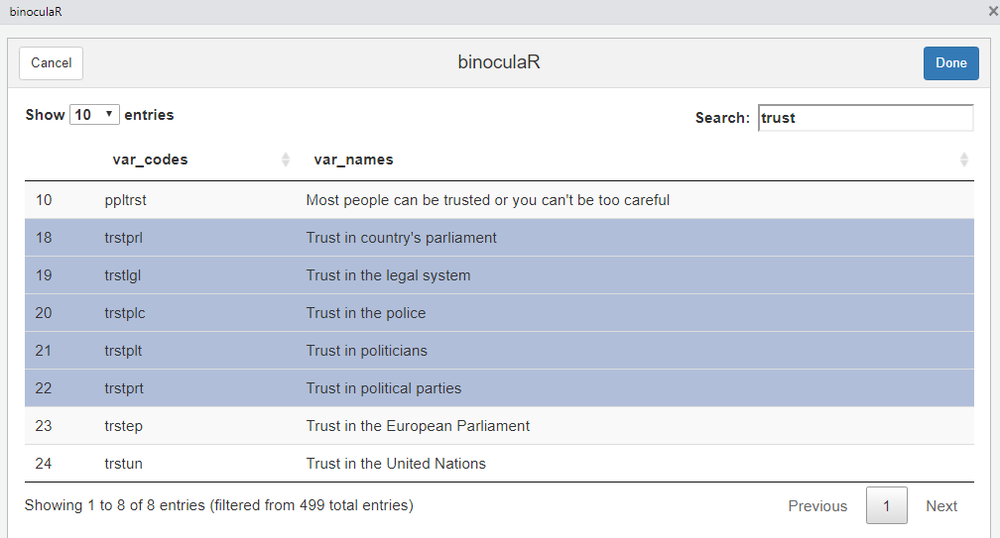
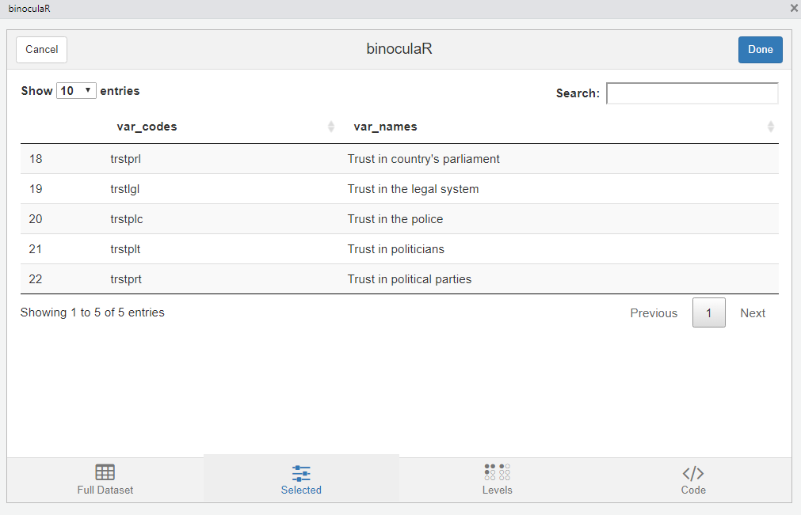
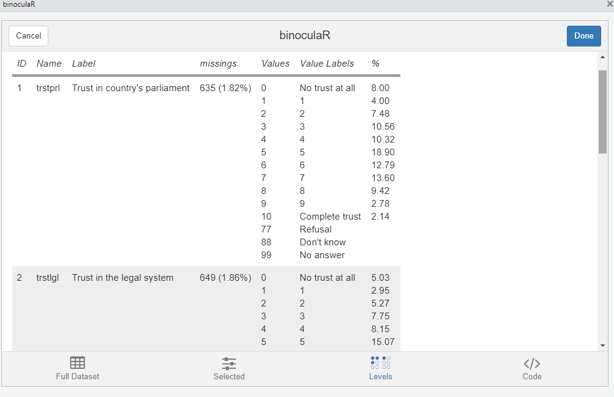
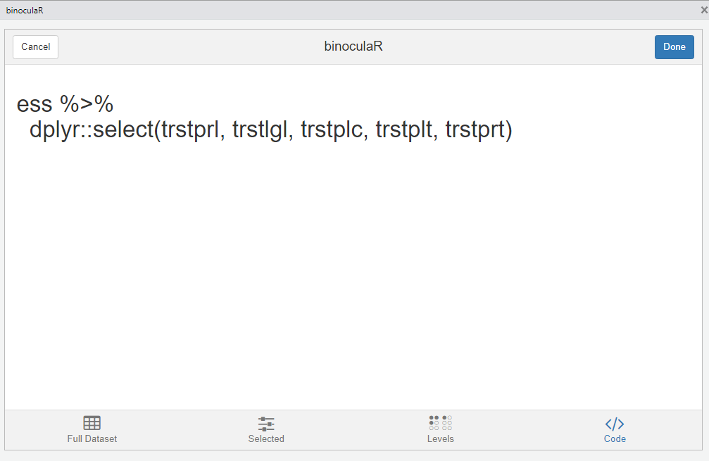

# binoculaR

This is a convienece gadget that returns the variable names of a labelled (SPSS) dataset. 


## Loading 

Load ESS Round 8 (2016) from github (as SPSS/ SAV File).

```r
# install.packages("haven")
library(haven)
ess <- read_spss("https://github.com/systats/binoculaR/raw/master/images/ess_round8.sav")
```

## Inspecting

Download package from github and proceed with the chunk.


```r
# devtools::install_github("systats/binoculaR")

binoculaR::binoculaR(ess)
```

Now you can inspect the dataset by browsing through the pages or use a search term.




## Selecting


After selecting the rows the specific set can be looked at in the `Selected` tab.




## Details

Take a look at some details of the selected variables in the `Levels`.




## Code

Copy and Paste the code from the `Code` sectino into R and go on with your analysis.




## The story behind the Name:


My friend [Fabio](twitter.com/favstats) was teaching SPSS and R to graduate students. In SPSS, you have the possiblity to click on the `Binocular` icon to search for variables, which is pretty convenient. Unfortunately, Fabio lamented, one can't do that easily in R. Well, that day we sat down together and created a gadget that would do exactly and that is why it's called... `binoculaR`.

